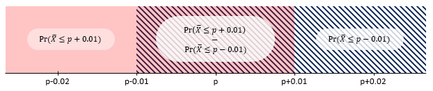
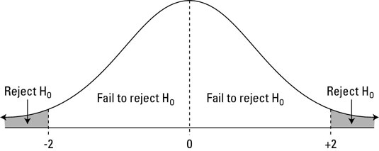
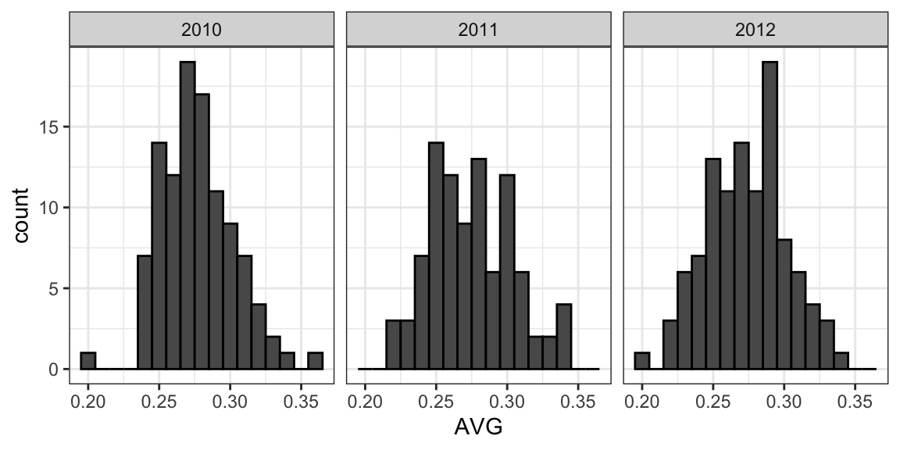
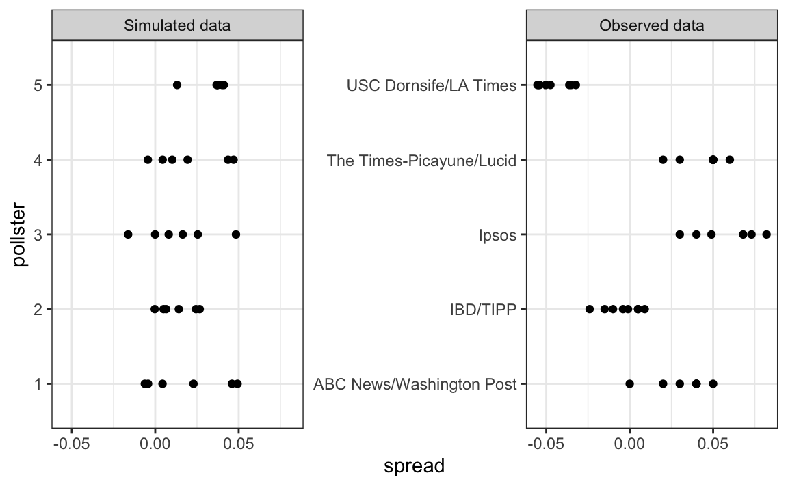
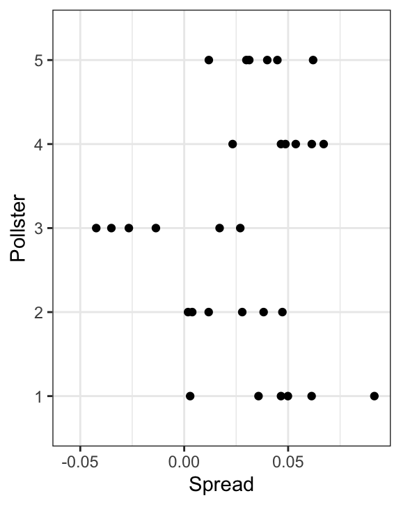
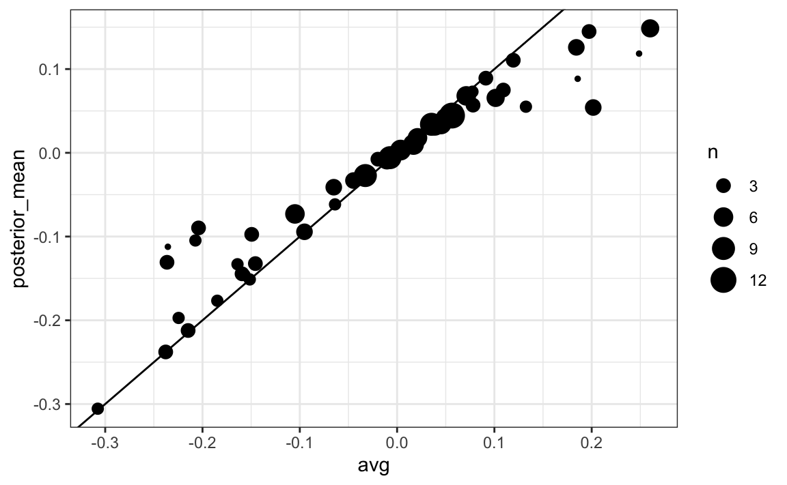
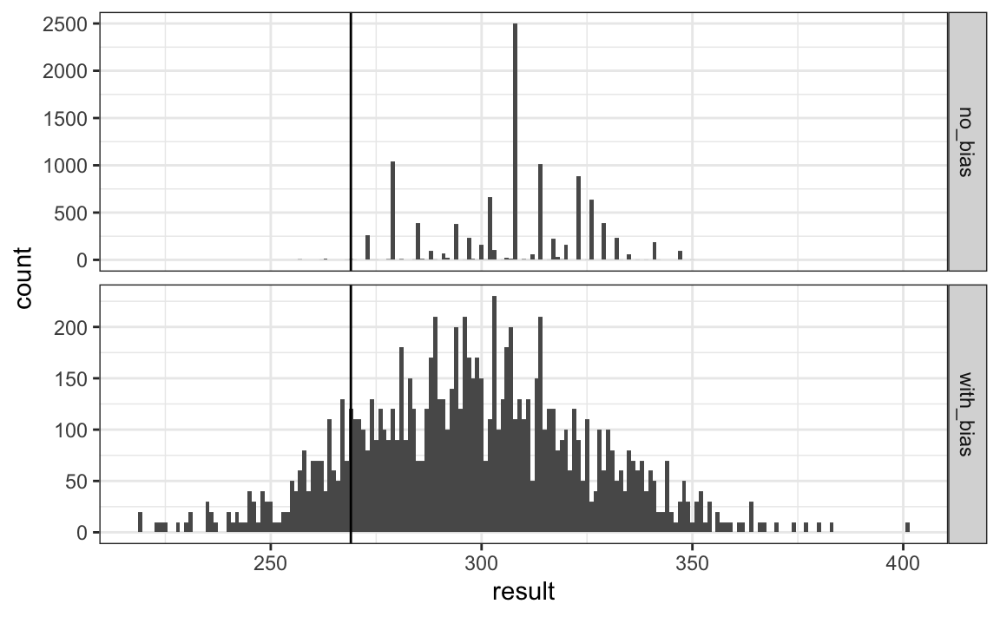
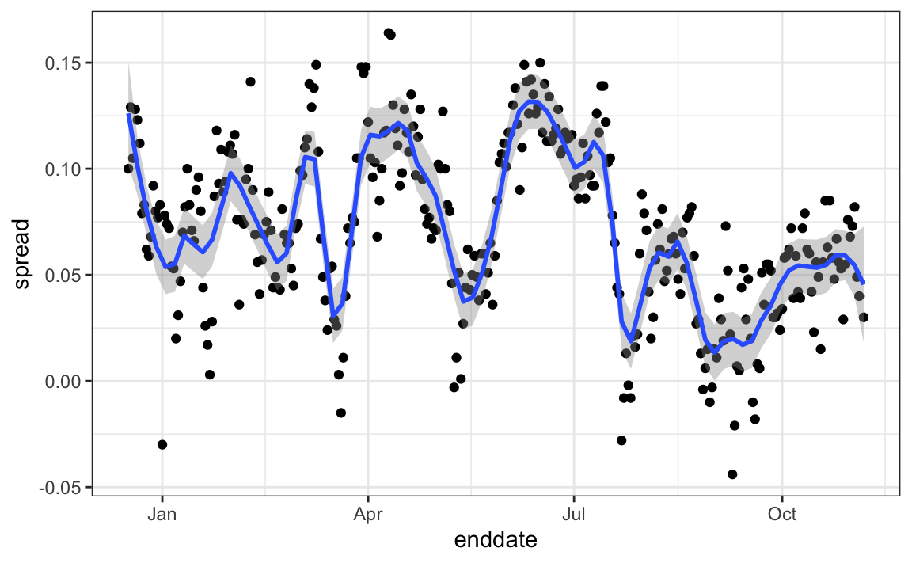
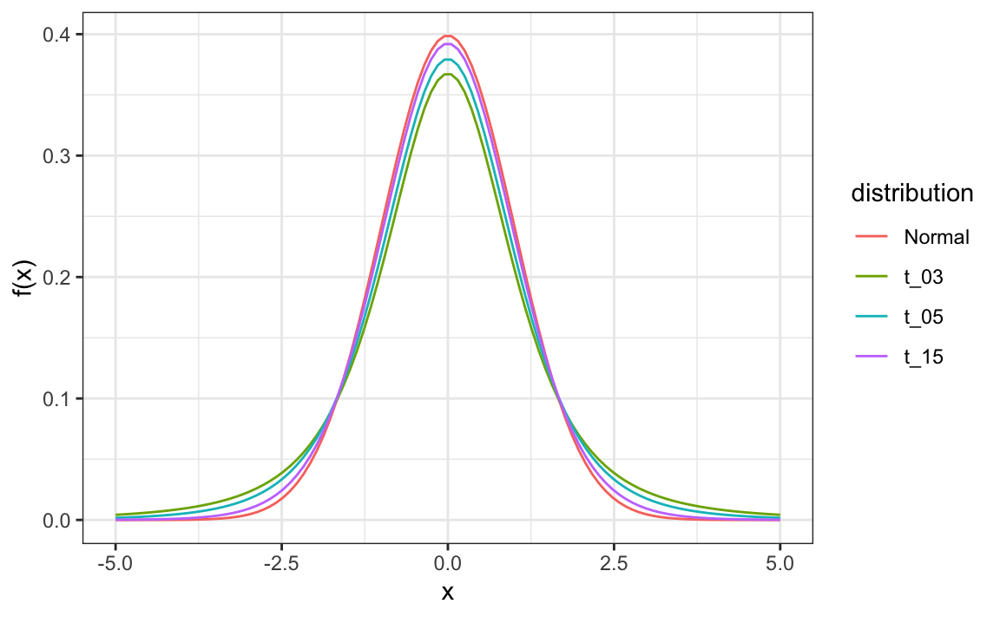

```{r setup, include=FALSE}
knitr::opts_chunk$set(echo = TRUE)
set.seed(061102)
library(tidyverse)
library(dslabs)
library(gridExtra)
```

## Introduction

**Statistical inference** is the process of deducing characteristics of a population using data from a random sample.

Information gathered from a small random sample can be used to infer characteristics of the entire population. Opinion polls are useful when asking everyone is impossible, one common use of them is for determining voter preferences in political elections for the purposes of forecasting results.

The **spread** of a political poll is the estimated support difference between two candidates.

------------------------------------------------------------------------

## Parameters and Estimates

As an example, instead of voters let's imagine an urn with blue balls and red balls. And because the pollsters (orgs. that make the polls) compete with other pollsters for media attention, we'll imitate that with a \$25 prize.

To mimic also the fact that running polls is expensive, it will cost \$0.10 per ball sampled, meaning that a 250 sized sample will cost \$25.

You get asked to submit an interval, if the interval submitted contains the true proportion then you get half of what you paid for samples and you move into the next round. In the next round the entry with the smallest interval is selected as the winner.

The `dslabs` package includes a function that shows a random draw from the urn explained previously. Here's a sample with 25 balls:

```{r echo=TRUE, message=FALSE, warning=FALSE}
ds_theme_set()	# sets a ggplot2 theme used throughout the data science labs
take_poll(25)
```

In our competition we want to predict the proportion of blue balls, let's call it $p$. Which means that the proportion of red balls is $1-p$, and the **spread** is equal to $p-(1-p)$ or $2p-1$.

The goal of **statistical inference** is to predict $p$ (in statistics called **parameter**) using the observed data in the sample. Is it possible to do that with the sample of the urn generated in the previous code chunk?

Well it does give some insight. For example it is unlikely that $p$ is bigger than **0.9** or smaller than **0.1**, if they were then it would be un-probable to see 10 blue balls and 15 red balls (quantities gotten in one of the runs of the code chunk). But even then, are we ready to predict with certainty that there are more red balls?

What we want is make an estimate of $p$ using only the information observed. Its intuitive to think that the proportion of blue balls observed previously (**0.4**) must be related to the actual proportion, but do we simply predict $p=0.4$ ?

Note that the sample proportion $p$ is a random variable, each time we run the code we get a different proportion.

------------------------------------------------------------------------

## The Sample Average

Let's define the random variable (picking one ball from the urn) as $X$, so $X=1$ if the ball is blue and $X=0$ if the ball is red. So $\overline{X} = \frac{X_1+X_2+...+X_N}{N}$ for $N$ balls extracted (the line over the $X$ is to represent the average, $\overline{X}$ represents the average of $X$).

The number of blue balls drawn in $N$ draws, $N\overline{X}$, is $N$ times the proportion of values n the urn. However, we don't know the true proportion since we are trying to estimate that parameter $p$.

------------------------------------------------------------------------

## Properties of our Estimate

It is important to remember that $\overline{X}$ is a random variable with an expected value and standard error that represents the sample proportion of sample events.

The expected value of $\overline{X}$ is the parameter of interest $p$. This follows from the fact that $\overline{X}$ is the sum of independent draws of a random variable times a constant $1/N$.

$$
E(\overline{X})=p
$$

As the number of draws $N$ increases, the standard error of our estimate $\overline{X}$ decreases. The standard error of the average of $\overline{X}$ over $N$ draws is:

$$
SE(\overline{X})=\sqrt{p(1-p)/N}
$$

In theory we can get more accurate estimates of $p$ by increasing $N$. In practice though, there are limits on the size of $N$ due to costs and other factors.

------------------------------------------------------------------------

## The Central Limit Theorem in Practice

The **CLT** tells us that the distribution function for a sum of draws is approximately normal. Because $\overline{X}$ is the sum of random draws divided by a constant $N$, the distribution of $\overline{X}$ is approximately normal.

As an example, **what is the probability that we are within 1 percentage point of** $p$**?** So we are asking for the probability of the distance between $\overline{X}$ and $p$ being less than or equal to 0.01:

$$
Pr(|\overline{X}-p|\le0.01)
$$

This formula denotes the probability that the sample mean $\overline{X}$ falls within an interval of $p-0.01$ and $p+0.01$, so we can translate that formula to:

$$
Pr(\overline{X}\le p+0.01) - Pr(\overline{X}\le p-0.01)
$$

We can **standardize** the variable by **subtracting the expected value** and then **divide by the standard error** on both sides of the equation:

$$
Pr(\frac{\overline{X}-E[\overline{X}]}{SE[\overline{X}]} \le \frac{(p+0.01)-E[\overline{X}]}{SE[\overline{X}]})
-
Pr(\frac{\overline{X}-E[\overline{X}]}{SE[\overline{X}]} \le \frac{(p-0.01)-E[\overline{X}]}{SE[\overline{X}]})
$$

Standardization

:   Statistical technique used in data to make different variables more comparable, there are different formulas for each normalization.

    When you **subtract the mean** from the variable, you are centering the distribution around 0, this shifts the entire distribution so that its center is at zero. If $X$ has a mean $\mu$, then $X-\mu$ has a mean of zero:

    $$
    mean(X-\mu) = \mu-\mu=0
    $$

    And when you **divide by the standard deviation**, you are scaling the distribution so that its spread corresponds to the standard normal distribution, which has a standard deviation of 1. If $X$ has a standard deviation $\sigma$, then $(X-\mu)/\sigma$ has a standard deviation of 1:

    $$
    sd(\frac{X-\mu}{\sigma})=\frac{\sigma}{\sigma}=1
    $$

Back to the formula created after the **standardization**, now we have a standard normal variable $Z$ on the left side:

$$
Pr(Z \le \frac{(p+0.01)-E[\overline{X}]}{SE[\overline{X}]})
-
Pr(Z \le \frac{(p-0.01)-E[\overline{X}]}{SE[\overline{X}]})
$$

And since $E(\overline{X}) = p$ and $SE(\overline{X})=\sqrt{p(1-p)/N}$ , we get that the probability that we were calculating is:

$$
Pr(Z \le \frac{(p+0.01)-p}{\sqrt{p(1-p)/N}})
-
Pr(Z \le \frac{(p-0.01)-p}{\sqrt{p(1-p)/N}})
$$

$$
Pr(Z \le \frac{p-p+0.01}{\sqrt{p(1-p)/N}})
-
Pr(Z \le \frac{p-p-0.01}{\sqrt{p(1-p)/N}})
$$

$$
Pr(Z \le \frac{0.01}{\sqrt{p(1-p)/N}})
-
Pr(Z \le \frac{-0.01}{\sqrt{p(1-p)/N}})
$$

The problem is that we still don't know $p$. But it turns out that the **CLT** still works if we use an estimate of the standard error that, instead of $p$ , uses $\overline{X}$ (this is called a **plug-in-estimate**).

$$
Pr(Z \le \frac{0.01}{\sqrt{\overline{X}(1-\overline{X})/N}})
-
Pr(Z \le \frac{-0.01}{\sqrt{\overline{X}(1-\overline{X})/N}})
$$

Our **estimate of the standard error** (**NOT** the standard error) is therefore:$\hat{SE}(\overline{X}) = \sqrt{\overline{X}(1-\overline{X})/N}$ (in statistics the little hat over the $SE$ denotes estimates).

$$
Pr(Z \le \frac{0.01}{\hat{SE}}) - Pr(Z \le \frac{-0.01}{\hat{SE}})
$$

Let's compute this **estimate of the standard error** using the first sample that we took, in which we had 15 red balls and 10 blue balls, in that case $\overline{X} = 0.4$.

```{r echo=TRUE, message=FALSE, warning=FALSE}
X_hat <- 0.4
se <- sqrt(X_hat*(1-X_hat)/25)
se
```

We get an **estimate of the standard error** of `0.097`, so now we can answer the question by computing the probability of being as close to $p$ as we wanted (to be *1 percentage point away*):

```{r echo=TRUE, message=FALSE, warning=FALSE}
pnorm(0.01/se) - pnorm(-0.01/se)
```

The function `pnorm()` gives the probability that a standard normal random variable will be less than or equal to a given value, for example `pnorm(0)` would be equal to $0.5$ (since in a normal distribution is $0$).

In this context we use `pnorm()` to find the probability that the sample mean $\overline{X}$ is within 1 percentage point (0.01) of the true population proportion $p$.

-   `pnorm(0.01/se)` gives the probability that $\overline{X}$ is 1 percentage point (0.01) **above** $p$ $Pr(\overline{X}\le p+0.01)$.

-   `pnorm(-0.01/se)` gives the probability that $\overline{X}$ is 1 percentage point (0.01) **under** $p$ $Pr(\overline{X}\le p-0.01)$.

We subtract the two because we want to know the probability of $\overline{X}$ being between 0.01 and -0.01. Here's a picture that explains it:

------------------------------------------------------------------------

## Margin of Error

The **margin error** ($E$) is defined as $E = c * \frac{\sigma}{\sqrt{n}}$, where $c$ is the z-score of the confidence level and $\frac{\sigma}{\sqrt{n}}$ is the standard error, so the **margin of error is confidence level \* standard error**. In this case $c = 2$, why? Because if you ask the probability that we are within $2$ standard errors from $p$, we get:

$$
Pr(|\overline{X}-p| \le 2SE(\overline{X}))
$$

$$
Pr(\overline{X} \le p + 2SE(\overline{X})) -
Pr(\overline{X} \le p - 2SE(\overline{X}))
$$

$$
Pr(\frac{\overline{X} - E(\overline{X})}{SE(\overline{X})} \le \frac{(p + 2SE(\overline{X}))-E(\overline{X})}{SE(\overline{X})})
-
Pr(\frac{\overline{X} - E(\overline{X})}{SE(\overline{X})} \le \frac{(p - 2SE(\overline{X}))-E(\overline{X})}{SE(\overline{X})})
$$

$$
Pr(\frac{\overline{X} - E(\overline{X})}{SE(\overline{X})} \le \frac{(E(\overline{X}) + 2SE(\overline{X}))-E(\overline{X})}{SE(\overline{X})})
-
Pr(\frac{\overline{X} - E(\overline{X})}{SE(\overline{X})} \le \frac{(E(\overline{X}) - 2SE(\overline{X}))-E(\overline{X})}{SE(\overline{X})})
$$

$$
Pr(Z \le \frac{2SE(\overline{X})}{SE(\overline{X})}) -
Pr(Z \le \frac{-2SE(\overline{X})}{SE(\overline{X})})
$$

$$
Pr(Z \le 2\frac{SE(\overline{X})}{SE(\overline{X})}) -
Pr(Z \le -2\frac{SE(\overline{X})}{SE(\overline{X})})
$$

$$
Pr(Z\le 2) - Pr(Z \le -2)
$$

And we can calculate this with R:

```{r echo=TRUE, message=FALSE, warning=FALSE}
pnorm(2) - pnorm(-2)
```

So there's a **95%** chance (**0.95**) that $\overline{X}$ will be within $2* \hat{SE}(\overline{X})$, in our case it would be $2 * 0.097 = 0.194$ to $p$.

The choice of using 95% is arbitrary, but traditionally that's the most common value to define margins of errors.

In summary, the **CLT** tells us that our poll based on a sample of just 25 is not useful, all we can say is that the popular vote will not be won by a large margin. This is why pollsters use larger sample sizes, usually between 700 and 3500.

For example, if our $\overline{X} =0.4$ was obtained from a sample size $N$ of 2500, then $\hat{SE}(\overline{X}) = \sqrt{\overline{X}(1-\overline{X})/N} = \sqrt{0.4(1-0.4)/2500} = 0.0097$, and if we use this **estimated standard error** to calculate the probability of being as close to $p$ as we wanted (to be *1 percentage point away*):

```{r echo=TRUE}
pnorm(0.01/0.0097) - pnorm(-0.01/0.0097)
```

From the $0.45$ that we got in our sample of size 25, we have gone up to $0.69$ with our sample of 25000. There was a **24%** increase in the probability that our sample mean is 1 percentage point away from $p$. But all this is hypothetical, we didn't take a poll from a 2500 sized sample.

------------------------------------------------------------------------

## A Monte Carlo Simulation for the CLT

Suppose we want to use a Monte Carlo simulation to check that the tools that we've been using to build estimates and margins of errors using theory actually work. To create the simulation we would simply write the urn model and use replicate to construct the simulation, like this:

```{r eval=FALSE}
B <- 10000
N <- 1000
X_hat <- replicate(B, {
	X <- sample(c(0, 1), size = N, replace = T, prob = c(1-p, p))
	mean(X)
})
```

The problem is, of course, that we don't know the value of `p`, we can't run this code.

However, we could create an urn and actually run an analog simulation, it would take a long time because you would be picking balls and counting them, but you could take 10000 samples, count the balls each time and keep track of the proportions seen.

So one thing we can do to corroborate theoretical results is to pick several values of $p$ and then run simulations using those. As an example, let's set $p=0.45$, we can simulate one poll of 1000 people (balls extracted from urn) using this code:

```{r echo=TRUE, message=FALSE, warning=FALSE}
p <- 0.45
N <- 1000
X <- sample(c(0, 1), size = N, replace = T, prob = c(1-p, p))
x_hat <- mean(X)
x_hat
```

Now we run it 10000 times in a Monte Carlo simulation:

```{r echo=TRUE, message=FALSE, warning=FALSE}
B <- 10000
x_hat <- replicate(B, {
	X <- sample(c(0, 1), size = N, replace = T, prob = c(1-p, p))
	mean(X)
})
```

To review, the theory told us that $\overline{X}$ has an approximately normal distribution with expected value **0.45** and a standard error of about **1.5%**. The simulation confirms this:

```{r echo=TRUE, message=FALSE, warning=FALSE}
mean(x_hat)
sd(x_hat)
```

A histogram and QQ-plot of this $\overline{X}$ data confirms that the normal approximation is accurate as well:

```{r echo=TRUE, message=FALSE, warning=FALSE}
p1 <- data.frame(x_hat = x_hat) %>%
    ggplot(aes(x_hat)) +
    geom_histogram(binwidth = 0.005, color = "black")
p2 <- data.frame(x_hat = x_hat) %>%
    ggplot(aes(sample = x_hat)) +
    stat_qq(dparams = list(mean = mean(x_hat), sd = sd(x_hat))) +
    geom_abline() +
    ylab("X_hat") +
    xlab("Theoretical normal")
grid.arrange(p1, p2, nrow=1)
```

But we could do this for various values of $p$ and $N$ and see that the theory does indeed work well for most values.

------------------------------------------------------------------------

## Spread

The goal of the competition, in this scenario created, is to predict the spread and not the proportion $p$. However, because there are only two parties (red and blue), we know that the spread is $p-(1-p)$ which is equal to $2p-1$.

Once we have our estimate $\overline{X}$ and our estimate of our standard error $SE(\overline{X})$, we estimate the spread by replacing the $p$ by our estimate: $2\overline{X} - 1$. And in statistics when you multiply a random variable ($\overline{X}$) by a constant ($2$), the standard error of that variable also gets multiplied by the same constant. So the standard error of this new random variable is $SE(2\overline{X} - 1) = 2\hat{SE}(\overline{X})$.

The standard error is affected by linear transformations of the random variable, but not by constant shifts:

-   When **multiplying a random variable by a constant** ($2$) the standard error scales by the same constant.

-   When **subtracting a constant from the random variable** ($-1$) it doesn't change the variability or the spread of the distribution. The standard error, which measures variability, remains unaffected by the subtracting of a constant

So for our first example with just 25 balls, our estimate of $p$ was **0.4** with a margin of error of **0.2**. This means that our estimate of the spread is $2*0.4-1 = -0.04$ (4 percentage points) with a margin of error $0.4$ (2 times the margin of error of $\overline{X}$ which is $0.2$).

This is not very useful, but the point is that once we have an estimate and standard error for $p$, we have it for the spread $2p-1$.

------------------------------------------------------------------------

## Bias: Why not run a very large poll?

For realistic values of $p$ (say between 0.35 and 0.65), if we run a very large poll with 100000 people theory would tell us that we would predict the election almost perfectly, since the largest possible margin of error is 0.3%. Here are the calculations:

```{r echo=TRUE, message=FALSE, warning=FALSE}
N <- 100000
p <- seq(0.35, 0.65, length = 100)
SE <- sapply(p, function(x) 2*sqrt(x*(1-x)/N))
data.frame(p = p, SE = SE) %>%
    ggplot(aes(p, SE)) +
    geom_line()
```

So why are there no pollsters conducting polls with sample sizes this large? a reason mentioned before is that is very expensive, but perhaps a more important reason is that theory has its limitations, polling is much more complicated than picking balls from an urn.

While balls are either blue or red and you can see it with your eyes, when you ask people for an election poll they might lie. Besides, because these polls are usually conducted by phone, the pollsters might miss people that don't have a phone.

But the biggest difference between our urn model from an actual poll is that we don't know for sure who is and who isn't in our population. How do we know who is going to vote? Are we reaching all possible voters? So even if our margin of error is very small, it may not be exactly right that our expected value is $p$. This is called **bias**.

Historically we observe that polls are biased, but not by that much. The typical bias is between 1% and 2%.

------------------------------------------------------------------------

## Confidence Intervals

Confidence intervals are very useful and widely used by data scientists, a version of these that are very commonly seen come from the `ggplot` geometry `geom_smooth()`. Here's an example with weather data:

```{r echo=TRUE, message=FALSE, warning=FALSE}
data("nhtemp")
data.frame(year = as.numeric(time(nhtemp)), temperature = as.numeric(nhtemp)) %>%
    ggplot(aes(year, temperature)) +
    geom_point() +
    geom_smooth(method = 'loess', formula = 'y ~ x') +
    ggtitle("Average Yearly Temperatures in New Haven")
```

The shaded area around the curve is created using confidence intervals.

In our competition we were asked to give an interval, you get half of the money spent and go into the next round if the interval submitted includes $p$.

95% confidence intervals are intervals constructed to have a 95% chance of including $p$. The margin of error is approximately a 95% confidence interval.

We want to know the probability that the interval $[\overline{X}-2*\hat{SE}(\overline{X}),\ \ \ \overline{X}+2*\hat{SE}(\overline{X})]$ contains the actual proportion of $p$. Note that the start and end of this intervals are random variables, every time we run a sample, they change. Let's run a Monte Carlo simulation 5 times to show there's variance between intervals:

```{r echo=TRUE, message=FALSE, warning=FALSE}
p <- 0.45
N <- 1000
intervals <- replicate(5, {
	X <- sample(c(0,1), size = N, replace = TRUE, prob = c(1-p, p))
	X_hat <- mean(X)
	SE_hat <- sqrt(X_hat*(1-X_hat)/N)
	c(X_hat - 2*SE_hat, X_hat + 2*SE_hat)
})

# Transpose the matrix and add column labels
intervals <- t(intervals)
colnames(intervals) <- c("Lower Bound", "Upper Bound")
rownames(intervals) <- paste("Interval", 1:nrow(intervals))
intervals
```

To determine the probability that the interval includes $p$, we need to compute:

$$
Pr(\overline{X}-2*\hat{SE}(\overline{X}) \le \ \ p \ \ \le \overline{X}+2*\hat{SE}(\overline{X}))
$$

Now we subtract and divide the same quantities in all parts of the equation:

$$
Pr(\frac{\overline{X}-2*\hat{SE}(\overline{X})-\overline{X}}{\hat{SE}(\overline{X})}
\le \ \ 
\frac{p-\overline{X}}{\hat{SE}(\overline{X})} \ \ \le
\frac{\overline{X}+2*\hat{SE}(\overline{X})-\overline{X}}{\hat{SE}(\overline{X})}
$$

$$
Pr(\frac{-2*\hat{SE}(\overline{X})}{\hat{SE}(\overline{X})}
\le \ \ 
\frac{p-\overline{X}}{\hat{SE}(\overline{X})} \ \ \le
\frac{2*\hat{SE}(\overline{X})}{\hat{SE}(\overline{X})}
$$

$$
Pr(-2
\le \ \ 
\frac{p-\overline{X}}{\hat{SE}(\overline{X})} \ \ \le
2)
$$

$$
Pr(-2
\le \ \ 
\frac{-\overline{X}-p}{\hat{SE}(\overline{X})} \ \ \le
2)
$$

$$
Pr(-2
\le \ \ 
\frac{\overline{X}-p}{\hat{SE}(\overline{X})} \ \ \le
2)
$$

Eliminating the negative sign

:   Multiplying or dividing by -1 flips the inequality signs. However, since the bounds are **symmetric around 0** ($[-2, \ 2]$, 2 units from each side), the range of the probability statement remains unchanged.

    The symmetry means that if a variable $a$ can take any value between $-2$ and $2$, then $-a$ will also take values within the same range but in reverse order. Since the range is **symmetric around 0**, flipping the sign of the term doesn't change the probability or the bounds of the interval

Back to our formula, the expression in the middle is an approximately normal random variable with expected value 0 and standard error 1, which we can denote as $Z$ (as we have done so far):

$$
Pr(-2 \le Z \le 2)
$$

Which we previously computed using `pnorm()`, but we can compute it again just to show

```{r echo=TRUE, message=FALSE, warning=FALSE}
pnorm(2) - pnorm(-2)
```

If we want to have a larger probability, let's say a **99% confidence interval**, we need to multiply by whatever $z$ satisfies the following equation:

$$
Pr(-z \le Z \le z) = 0.99
$$

This asks what value $z$ has to be so that the probability of $Z$ being between $[-z, \ z]$ is **99%**. Therefore, the interval $[-z, \ z]$ should cover **99\$** of the normal distribution's area, leaving **0.5%** on each side.

The cumulative distribution function $\Phi(z)$ gives the probability that $Z$ is less than or equal to $z$, we need to find $z$ such:

$$
Pr(-z \le Z \le z) = \Phi(z) - \Phi(-z) = 0.99
$$

Since the distribution is symmetric: $\Phi(z) + \Phi(-z) = 1$, this is because the total area under the normal distribution curve is **1**, so the area to the left of $-z$ plus the area to the right of $z$ must add up to **1** since the curve is symmetric. We simplify it to:$$
\Phi(-z) = 1-\Phi(z)
$$

And now we can replace $\Phi(-z)$ in the previous formula:

$$
\Phi(z)-\Phi(-z)=0.99
$$

$$
\Phi(z)  -  (1-\Phi(z))=0.99
$$

$$
\Phi(z)-1+\Phi(z)=0.99
$$

$$
2\Phi(z)-1=0.99
$$

$$
2\Phi(z)=0.99+1
$$

$$
2\Phi(z)=1.99
$$

$$
\Phi(z)=1.99/2
$$

$$
\Phi(z)=0.995
$$So we have $\Phi(z)=0.995)$, thus the quantile $z$ that satisfies the original probability condition can be found using `qnorm()`:

```{r echo=TRUE, message=FALSE, warning=FALSE}
z <- qnorm(0.995)
z
```

And we know that when $Pr(-z \le Z \le z)$, we can compute the result using `pnorm()`:

```{r echo=TRUE, message=FALSE, warning=FALSE}
pnorm(z)-pnorm(-z)
```

This gives us our desired **0.99**, which translates to a **99%** interval.

This approach can be used for any confidence interval size $q$ using the formula $1-\frac{1-q}{2}$. For example for a confidence interval **0.95** (**95%**):

$$
1-\frac{1-0.95}{2} = 1 - \frac{0.05}{2}=1-0.025 = 0.975
$$

So to determine a **95%** confidence interval we use `z <- qnorm(0.975)` ($z = 1.96$).

We can run a Monte Carlo simulation to confirm that a **95% confidence interval** contains the value of $p$ 95% of the time.

```{r echo=TRUE, message=FALSE, warning=FALSE}
B <- 10000
inside <- replicate(B, {
    X <- sample(c(0,1), size = N, replace = TRUE, prob = c(1-p, p))
    X_hat <- mean(X)
    SE_hat <- sqrt(X_hat*(1-X_hat)/N)
    between(p, X_hat - 2*SE_hat, X_hat + 2*SE_hat)  # TRUE if p in conf. interval
})
mean(inside)
```

Here's a plot that shows 100 confidence intervals:

```{r echo=TRUE, message=FALSE, warning=FALSE}
results <- replicate(100, {
	X <- sample(c(0,1), size = N, replace = TRUE, prob = c(1-p, p))
	X_hat <- mean(X)
	SE_hat <- sqrt(X_hat*(1-X_hat)/N)
	lower_ci <- X_hat - 2*SE_hat
	higher_ci <- X_hat + 2*SE_hat
	p_inside <- between(p, lower_ci, higher_ci)
	return(c(X_hat, p_inside, lower_ci, higher_ci))
})
results_df <- as.data.frame(t(results))
colnames(results_df) <- c("estimate", "p_inside", "lower_ci", "higher_ci")
results_df <- results_df %>% mutate(poll = 1:100, p_inside = case_when(p_inside==1 ~ "yes", p_inside==0 ~ "no"))


results_df %>% ggplot(aes(y = poll)) +
	geom_segment(aes(x = lower_ci, xend = higher_ci, y = poll, yend = poll, color = p_inside)) +
	geom_point(aes(x=estimate, y=poll, color=p_inside, fill=p_inside)) +
	geom_vline(xintercept = p, color = "black", linewidth = 0.5, alpha = 0.5) +
	labs(x = "estimate", y = "poll")
```

As you can see only 5 intervals don't contain $p$, out of 100 that's **5%** (proving the **95% interval**).

Remember that the **intervals are random** but $p$ **is NOT random**. 95% refers to the probability that the random interval falls on top of $p$, which as you can see in the plot remains always the same (black vertical line). It is technically incorrect to state that $p$ has a 95% chance of being between two values because that implies that $p$ is random.

------------------------------------------------------------------------

## Power

Pollsters are not successful at providing correct confidence intervals, but rather at predicting who will win. When we took a 25 ball sample size, the confidence interval for the spread was:

```{r}
N <- 25
x_hat <- 0.48
(2 * x_hat - 1) + c(-1.96, 1.96) * 2 * sqrt(x_hat * (1 - x_hat) / N)
```

This confidence interval includes 0, if this were a poll we would have to say it was a toss-up.

A problem with our poll results is that given the sample size and the value of $p$, we would have to sacrifice the probability of an incorrect call to create an interval that does not include 0.

This doesn't mean that the election is close, it only means that we have a small sample size. In statistics this is called **lack of power**, in the context of polls **power** is the probability of detecting spreads different from 0.

**Power** increases as sample size increases, because larger sample size means smaller standard error.

------------------------------------------------------------------------

## p-Values

Let's suppose that we just want to know if there are more blue balls than red balls, so if $p$ is the proportion of blue balls:

$$
p > 1-p
$$

$$
p+p >1
$$

$$
2p-1>0
$$

We want to know if $2p -1 > 0$.

Suppose we take a random sample of 100 balls, and we observe 52 blue balls: $\overline{X}=0.52$. This gives us a spread of approximately $0.04$:

$$
SE(\overline{X})=\sqrt{\frac{\overline{X}*(1-\overline{X})}{n}}
$$

$$
SE(\overline{X})=\sqrt{\frac{0.52*(1-0.52)}{100}}
$$

$$
SE(\overline{X})=\sqrt{\frac{0.52*(1-0.52)}{100}}
$$

$$
SE(\overline{X})=\sqrt{0.002}=0.04
$$

This seems to be pointing to there being more blue balls than read balls, 0.04 is larger than 0, 0.52 is larger than 0.48. However we need to be skeptical, we know there's chance involved in the process. We could get 0.52 as $\overline{X}$ even if the actual spread is 0.

The **null hypothesis** is the hypothesis that there is no effect. In this case, the null hypothesis is that the spread is 0 or $p=0.5$.

The **p-value** is the answer to the question: how likely is to see a value this large, when the null hypothesis is true? So we write (assuming $p=0.5$):

$$
Pr(|\overline{X}-0.5|>0.02
$$

Under the null hypothesis we know that...

$$
\sqrt{N}\frac{\bar{X}-0.5}{\sqrt{0.5(1-0.5)}}
$$

...is a standard normal. This formula comes from taking the random variable, subtracting its expected value and then dividing it by its standard error.

We know can compute the probability:

$$
Pr(\sqrt{N}*\frac{|\overline{X}-p|}{\sqrt{0.5(1-0.5)}}>\sqrt{N}*\frac{0.02}{\sqrt{0.5(1-0.5)}})
$$

$$
Pr(\sqrt{N}*\frac{|\overline{X}-p|}{\sqrt{0.5(1-0.5)}}>Z)
$$

```{r echo=TRUE, message=FALSE, warning=FALSE}
N <- 100    # sample size
z <- sqrt(N) * 0.02/0.5    # spread of 0.02
1 - (pnorm(z) - pnorm(-z))
```

This computation gives us 69%, this is the p-value. In this case there's a large chance of seeing 52 blue balls or more under the null hypothesis that there is the same amount of blue balls as red balls. So the 52 blue balls are not very strong evidence if we want to make the case that there's more blue balls than red balls.

Note that there's a strong connection between confidence intervals and p-values, if a 95% confidence interval of the spread does not include 0, we know that the p-value must be smaller than 0.05.

The **p-value** is the probability of observing a value as extreme or more extreme than the result given that the null hypothesis is true.

In the context of the normal distribution, this refers to the probability of observing a z-score whose absolute value is as high or higher than the z-score of interest.

Imagine we're testing something. When we say "assuming the null hypothesis is true," we're checking the chance of seeing a result like the one we got, or even more extreme, just by random chance.

For example, if we're looking at data that's 2 standard deviations above the average, we want to know how likely it is to see something that extreme or even more extreme, this means we are looking for anything with $|z|>2$. This is what we call the p-value.

Graphically, the p-value gives the probability of an observation that's at least as far away from the mean or further. This plot shows a standard normal distribution (centered at $z=0$ with a standard deviation of 1). The shaded tails on both ends of the curve show where we would reject the null hypothesis ($H_0$), this happens when the z-score is less than -2 or greater than +2.



The right tail can be found with `1-pnorm(2)`. We want to have both tails, though, because we want to find the probability of any observation as far away from the mean or farther, in either direction.

(This is what's meant by a two-tailed p-value) Because the distribution is symmetrical, the right and left tails are the same size and we know that our desired value is just `2*(1-pnorm(2))`.

By default, `pnorm()` gives the CDF for a normal distribution with a mean of $\mu=0$ and standard deviation of $\sigma=1$. To find p-values for a given z-score `z` in a normal distribution with mean mu and standard deviation `sigma,` use `2*(1-pnorm(z, mu, sigma))` instead.

------------------------------------------------------------------------

## Poll Aggregators

In 2012, Barack Obama won the popular vote by a margin of 3.9%. We are gong to generate results with Monte Carlo simulation for 12 polls taken the week before the election with the same sample sizes from actual polls, and we are going to construct and report 95% confidence intervals for each poll:

```{r echo=TRUE, eval=TRUE, results='hide'}
d <- 0.039
Ns <- c(1298, 533, 1342, 897, 774, 254, 812, 324, 1291, 1056, 2172, 516)
p <- (d+1)/2

confidence_intervals <- sapply(Ns, function(N){
    X <- sample(c(0,1), size=N, replace=TRUE, prob = c(1-p, p))
    X_hat <- mean(X)
    SE_hat <- sqrt(X_hat*(1-X_hat)/N)
    2*c(X_hat, X_hat - 2*SE_hat, X_hat + 2*SE_hat) - 1
})
```

-   `d` is the actual outcome, the actual spread

-   `Ns` are the sample sizes selected to mimic regular polls

-   `p` is the proportion of people voting for Obama

-   With the `sapply()`, for each sample size `N` in `Ns` we are going to take a sample then compute the proportion of people voting for Obama, construct a standard error and then return the estimate $\overline{X}$ and the confidence interval.

We are going to run the simulation and create a data frame with all the results:

```{r echo=TRUE}
polls <- data.frame(poll = 1:ncol(confidence_intervals),
                    t(confidence_intervals), sample_size = Ns)
names(polls) <- c("poll", "estimate", "low", "high", "sample_size")
polls
```

Although all polls include the result in their confidence interval, they also include 0, so with this the pollsters have to say it's a toss-up.

However, poll aggreagtors realized that by combining the results of different polls you could greatly improve precision. By doing this effectively, we are conducting a poll with a huge sample size.

Although as aggregators we don't have access to the raw poll data, we can use mathematics to reconstruct what we would have obtained had we made one large poll with, in this case, 11269 people.

Basically we construct an estimate of the spread, let's call it `d`, with a weighted average in the following way:

```{r echo=TRUE, eval=TRUE, results='hide'}
d_hat <- polls %>%
    summarize(avg = sum(estimate*sample_size) / sum(sample_size)) %>%
    .$avg
```

We multiply each individual spread by the sample size, that's going to give us a total spread. And then we're going to divide by the total number of participants in our aggregated poll. This gives us `d_hat` or $\overline{d}$, which is an estimate of $d$.

Once we have $\overline{d}$, we can construct an estimate for the proportion voting for Obama, which we can then use to estimate the standard error:

```{r echo=TRUE, message=FALSE, warning=FALSE}
p_hat <- (1+d_hat)/2
moe <- 2*1.96*sqrt(p_hat*(1-p_hat)/sum(polls$sample_size))
moe
```

We see that our margin of error of the aggregated poll is 0.018. Thus, using the weighted average, we can predict that the spread will be 3.1% plus or minus 1.8%, which includes the actual result but not 0.

------------------------------------------------------------------------

## Data and Pollster Bias

For this part we use public polling data organized by FiveThirtyEight for the 2016 presidential election. The data is included in the `dslabs` package:

```{r echo=TRUE, results='hide'}
data("polls_us_election_2016")
names(polls_us_election_2016)
```

First we filter the data to include national polls that happened during the week before the election, we'll also filter out the polls that FiveThirtyEight has determined not to be reliable (graded a B or less):

```{r echo=TRUE}
polls <- polls_us_election_2016 %>%
    filter(state == "U.S." & enddate >= "2016-10-31" &
               (grade %in% c("A+", "A", "A-", "B+") | is.na(grade)))
```

We also add a spread estimate since it's what we are really interested in estimating:

```{r echo=TRUE}
polls <- polls %>%
    mutate(spread = rawpoll_clinton/100 - rawpoll_trump/100)
```

Let's assume there are only two parties, with $p$ being the proportion voting for Clinton and $1-p$ the proportion voting for Trump, the spread is $d=2p-1$.

Poll results are a random normal variable with expected value of the spread $d$ and standard error $2\sqrt{p(1-p)/N}$. We can use this information to construct a confidence interval based on the aggregated data. The estimated spread is now computed like this because now the sample size is the sum of all the simple sizes:

```{r echo=TRUE}
d_hat <- polls %>%
    summarize(d_hat = sum(spread * samplesize) / sum(samplesize)) %>%
    .$d_hat
d_hat
```

We can now compute the margin of error:

```{r echo=TRUE}
p_hat <- (d_hat+1)/2
moe <- 1.96 * 2 * sqrt(p_hat*(1-p_hat)/sum(polls$samplesize))
moe
```

This gives us a margin of error of **0.0066**, a very small margin of error. So if we were to use this data, we would report a spread of **1.43%** and a margin of error of **0.66%**.

In the election night we find out that the actual percentage is **2.1%**, which is outside of the confidence interval. What happened? Let's make a histogram of the spreads of the poll:

```{r echo=TRUE}
polls %>%
    ggplot(aes(spread)) +
    geom_histogram(color="black", binwidth = .01)
```

The data doesn't appear to be normally distributed, and the standard error appears to be larger than 0.0066. The theory is not quite working here, why?

```{r echo=TRUE}
polls %>% group_by(pollster) %>% summarize(n())
```

Notice that various pollsters are involved and some take several polls a week. Let's visualize the data for pollsters that polled more than 6 times:

```{r echo=TRUE}
polls %>% group_by(pollster) %>%
    filter(n() >= 6) %>%
    ggplot(aes(pollster, spread)) +
    geom_point() +
    theme(axis.text.x = element_text(angle = 90, hjust = 1))
```

First note that the standard error predicted by theory for each poll, shown in the code below, gives us values between 0.018 and 0.033, this appears to be consistent with what we see in the plot:

```{r echo=TRUE}
polls %>% group_by(pollster) %>%
    filter(n() >= 6) %>%
    summarize(se = 2 * sqrt(p_hat * (1-p_hat) / median(samplesize)))
```

However there are differences across the polls, this is not explained by the theory. The USC Dornsife/LA Times is predicting a 4% win for Trump while Ipsos is predicting a win larger than 5% for Clienton.

The theory learned says nothing about different pollsters producing polls with different expected values.

This differences are called **house effects** or **pollster bias**. Rather than use urn model theory, we are instead going to develop a data-driven model to produce a better estimate and a better confidence interval.

------------------------------------------------------------------------

## Data-Driven Models

For each pollster, let's collect their last reported result before the election:

```{r echo=TRUE}
one_poll_per_pollster <- polls %>% group_by(pollster) %>%
    filter(enddate == max(enddate)) %>%      # keep latest poll
    ungroup()
```

Here's a histogram for the data of this 15 pollsters:

```{r echo=TRUE}
one_poll_per_pollster %>%
    ggplot(aes(spread)) + geom_histogram(binwidth = 0.01)
```

Instead of using an urn model where each poll is a random draw from the same distribution of voters, we instead define a model using an urn that contains poll results from all possible pollsters.

Now, because rather than zeros and ones our urn contains continuous numbers between minus 1 and 1, the standard deviation of the urn is no longer the $\sqrt{p(1-p)}$. Our new standard error $\sigma$ now factors in pollster-to-pollster variability. It can no longer be calculated from $p$ or $d$ and is an unknown parameter.

The central limit theorem still works to estimate the sample average of many polls $X_1, ..., X_N$ because the average of the sum of many random variables is a normal distributed random variable with expected value $d$ and standard error $\sigma/\sqrt{N}$.

The unknown $\sigma$ is defined by this formula:

$$
\sqrt{\frac{1}{N-1} \sum_{i=1}^{N} (X_i - \bar{X})^2}
$$

But in R we have the function `sd()`that we can use to compute the sample standard deviation:

```{r echo=TRUE}
sd(one_poll_per_pollster$spread)
```

We can now form a confidence interval based on our new data-driven model. We simply use the CLT and create a confidence interval using this code:

```{r echo=TRUE}
results <- one_poll_per_pollster %>%
    summarize(avg = mean(spread), se = sd(spread)/sqrt(length(spread))) %>%
    mutate(start = avg - 1.96*se, end = avg + 1.96*se)
round(results*100, 1)
```

We get an average (**2.9**), a standard error (**0.6**) and then a start of **1.7%** and an end of **4.1%**. That's our 95% confidence interval, it still includes the election result (2.1%) but it's small enough to not include 0.

Are we now ready to declare a probability of Clinton winning? Not yet. In our model $d$ is a fixed parameter, so we can't talk about probabilities. To provide probabilities we need to understand about Bayesian statistics.

------------------------------------------------------------------------

## Bayesian Statistics

In the classic urn model, it doesn't make sense to talk about the probability of $p$ being greater than a certain value because $p$ is a fixed value. We don't assign a probability to $p$ itself, we use data to make inferences about $p$. For example, we might estimate $p$ or create a confidence interval around it, but we don't say there's a probability that $p$ is within a certain range because $p$ is not a random variable.

In **Bayesian statistics**, we treat the parameter $p$ as a random variable with its own probability distribution. Because $p$ is considered a random variable, we can now talk about the probability that $p$ lies within a certain range. For example, we might say there's a 95% chance that $p$ is between 0.4 and 0.6.

One of the most successful approaches used to describe these levels of variability are called **hierarchical models**. For example, consider a study with students nested within schools, there's variability between students and variability within schools. A **hierarchical model** allows us to incorporate both levels of variability into our estimates.

In a hierarchical Bayesian model,, we might have parameters that vary at different levels (e.g., school-level parameters and student-level parameters). We use data from all levels to inform our estimates, leading to potentially more accurate and nuanced inferences about $p$.

------------------------------------------------------------------------

## Bayes' Theorem

To review this theorem, let's use a hypothetical cystic-fibrosis test as an example. Suppose a test for cystic fibrosis has a 99% accuracy, we will use the following notation to represent this:

$$
Pr(+ \ | \ D=1) = 0.99, \ \ Pr(- \ | \ D=1) = 0.99
$$

The left formula represents the probability of a positive test ($+$) given that you have the disease ($D=1$). The right formula represents the probability of a negative test ($-$) given that you don't have the disease ($D=0$).

Suppose we select a random person and they test positive, what is the probability that they have the disease?

$$
Pr(D=1 \ | \ +)
$$

The cystic fibrosis rate is 1 in 3,900, which implies the probability that $D=1$ is 0.00025. To answer the question, we are going to use **Bayes' theorem**, which in general tells us that:

$$
Pr(A \ | \ B)=\frac{Pr(A \ and \ B)}{Pr(B)}
$$

The probability of of event $A$ happening given that event $B$ happened is equal to the provability of them both happening divided by the probability of $B$.

The numerator is used using the multiplication rule:

$$
Pr(A \ | \ B) = \frac{Pr(B \ | \ A) \ * \ Pr(A)}{Pr(B)}
$$

Now it's the probability of $B$ happening given that $A$ happened times the probability of $A$, all this divided by $B$. This is useful because sometimes we know the probability of $A$ given $B$ but not the probability of $B$ given $A$, as is the case in this example.

Let's apply the Bayes' theorem equation to our cystic-fibrosis example:

$$
Pr(D=1 \ | \ +) = \frac{Pr(+ \ | \ D=1) \ * \ Pr(D=1)}{Pr(+)}
$$

... with event $A = having \ a \ disease$, and event $B = positive \ test$.

We also know that the $Pr(+)$ is the probability of having a positive test regardless of the disease, so it would be $Pr(+ \ | \ D=1)*Pr(D=1)$ (probability that a person has the disease and test positive) plus $Pr(+ \ | \ D=0)*Pr(D=0)$ (probability that a person doesn't have the disease and test positive).

$$
Pr(+)=Pr(+ \ | \ D=1)*Pr(D=1) \ + \ Pr(+ \ | \ D=0)*Pr(D=0)
$$

We use $Pr(+ \ | \ D=1)*Pr(D=1)$ for the probability that a person has the disease and test positive instead of just $Pr(+ \ | \ D=1)$ because this term alone represents the probability of testing positive given that a person has the disease. However, when we're considering the total probability of testing positive ($Pr(+)$), we need to account for how frequently each scenario (having or not having the disease) occurs in the overall population.

The **law of total probability** states that for any event $B$, the probability of $B$ can be found by summing the probabilities of $B$ occurring in conjunction with all possible conditions (partitions of the same space). In our case, the event $B$ is testing positive ($+$), and the conditions are having the disease or not.

Going back to the formula for $Pr(D=1 \ | \ +)$, now we can update it with the new value of $PR(+)$:$$
Pr(D=1 \ | \ +)=\frac{Pr(+ \ | \ D=1) \ * \ Pr(D=1)}{Pr(+ \ | \ D=1)*Pr(D=1) \ + \ Pr(+ \ | \ D=0)*Pr(D=0)}
$$

$$
Pr(D=1 \ | \ +)=\frac{0.99 \ * \ Pr(D=1)}{0.99*Pr(D=1) \ + \ Pr(+ \ | \ D=0)*Pr(D=0)}
$$

$$
Pr(D=1 \ | \ +)=\frac{0.99 \ * \ 0.00025}{0.99*0.00025 \ + \ Pr(+ \ | \ D=0)*Pr(D=0)}
$$

$$
Pr(D=1 \ | \ +)=\frac{0.99 \ * \ 0.00025}{0.99*0.00025 \ + \ 0.01*Pr(D=0)}
$$

$$
Pr(D=1 \ | \ +)=\frac{0.99 \ * \ 0.00025}{0.99*0.00025 \ + \ 0.01*0.99975}=0.02
$$

Despite the test having **99% accuracy**, the probability of having the disease given a positive test is only **2%**. The reason this is the case is because we have to factor the very rare possibility that a person chosen at random has the disease. Let's create a Monte Carlo simulation to visualize Bayes' theorem better.

We will select randomly 100,000 people and set the prevalence to be 0.00025 (the rate of the disease):

```{r echo=TRUE}
prev <- 0.00025    # disease prevalence
N <- 100000    # number of tests
outcome <- sample(c("Disease", "Healthy"), N, replace = TRUE, prob = c(prev, 1-prev))

N_D <- sum(outcome == "Disease")    # number with disease
N_H <- sum(outcome == "Healthy")    # number healthy

N_D
N_H
```

Also, there are many without the disease, which makes it more probable that we will see some false positives given that the test is not perfect. Now each person gets the test, which is correct 99% of the time. For each of the diseased and healthy people, we're going to sample either a correct or incorrect test with the appropriate probabilities, a very high probability of the correct test:

```{r echo=TRUE}
accuracy <- 0.99
test <- vector("character", N)
test[outcome == "Disease"]  <- sample(c("+", "-"), N_D, replace = TRUE, 
                                    prob = c(accuracy, 1 - accuracy))
test[outcome == "Healthy"]  <- sample(c("-", "+"), N_H, replace = TRUE, 
                                    prob = c(accuracy, 1 - accuracy))
table(outcome, test)
```

We can see that there are a lot of people that are healthy that got a positive outcome, that's because there are so many more healthy people. From this table we can see that the proportion of positive tests is out of a total of 26+1013, which is 1039. If you divide 26/1039 you get 0.02 (2%), which is exactly what Bayes' theorem told us it should be.

------------------------------------------------------------------------

## Bayes in practice

To demonstrate the usefulness of hierarchical models, Bayesian models, let's use a baseball example.

José Iglesias is a professional baseball player. In April 2013, when he was starting his career, he was performing rather well.

| Month | At Bats |  H  | AVG  |
|:-----:|:-------:|:---:|:----:|
| April |   20    |  9  | .450 |

The batting average (`AVG`) statistic is one way of measuring success. Roughly speaking, it tells us the success rate when batting. An `AVG` of .450 means José has been successful 45% of the times he has batted (`At Bats`) which is rather high, historically speaking. Keep in mind that no one has finished a season with an `AVG` of .400 or more since Ted Williams did it in 1941.

To illustrate the way hierarchical models are powerful, we will try to predict José’s batting average at the end of the season. Note that in a typical season, players have about 500 at bats.

With the techniques we have learned up to now, referred to as *frequentist techniques*, the best we can do is provide a confidence interval. We can think of outcomes from hitting as a binomial with a success rate of $p$. So if the success rate is indeed .450, the standard error of just 20 at bats is:

$$
\sqrt{\frac{0.450*(1-0.450)}{20}}=0.111
$$

We can use this to construct a 95% interval ($2*SE$), which will be $0.450-0.222$ to $0.450+0.222$ (or $0.228$ to $0.672$). This prediction has two problems: it's large (so it's not very useful) and it's centered at 0.450, which implies that our best guess is that this relatively unknown player will break Ted Williams' longstanding record.

This last statement will seem wrong and this is because you are implicitly using a hierarchical model that factors in information from years of following baseball. Here we show how we can quantify this intuition.

First, let’s explore the distribution of batting averages for all players with more than 500 at bats during the previous three seasons:



The average player had an `AVG` of .275 and the standard deviation of the population of players was 0.027. So we can see already that .450 would be quite an anomaly since it is over six standard deviations away from the mean.

So is José lucky or is he the best batter seen in the last 50 years? Perhaps it’s a combination of both luck and talent. But how much of each? If we become convinced that he is lucky, we should trade him to a team that trusts the .450 observation and is maybe overestimating his potential.

------------------------------------------------------------------------

## The Hierarchical Model

The **hierarchical model** provides a mathematical description of how we come to see the observation of .450. First, we pick a player at random with an intrinsic ability summarized by, for example, $p$. Then we see 20 random outcomes with success probability $p$.

We use a model to represent to levels of variability in our data. First, each player is assigned a natural ability to hit at birth, we will use $p$ to represent this ability, let's think of $p$ as a batting average you would have converged to if this particular player batted over and over and over and over again.

Based on the histograms showed before, we'll assume $p$ has a normal distribution. We also know that the expected value is about .270 and a standard error of .027.

Now the second level of variability has to do with luck. Regardless of how good or bad the player is, sometimes you have good luck and bad luck. At each at bat, this player has a probability of success $p$, if we add up these successes and failures as 0's and 1's the CLT tells us that the observed average (let's call it $Y$) has a normal distribution with expected value $p$ and standard error $\sigma = \sqrt{p(1-p)/N}$, with $N$ being the number of at bats.

The model would be $p \sim N( \mu , \tau)$, the $\sim$ denotes the distribution of something and $\tau$ represents the standard error. So this is telling us that $p$ (which now is a random variable) has a distribution that is normal with expected value $\mu$ and standard error $\tau$. This describes the randomness in picking a player.

Now we describe the distribution at the next level $Y \ | \ p \sim N(p, \sigma)$. So the distribution of the observed batting average $Y$, given that this player has a talent $p$ is also normally distributed with expected value $p$ and a standard error $sigma$. This describes the randomness in the performance of this particular player.

In our case, $\mu=0.270$, $\tau=0.027$ and $\sigma^2=p(1-p)/N$ (we used the $^2$ to remove the square root).

Because there are two levels, we call these hierarchical models. The first one is the player to player variability., the second is the variability due to luck when batting. In a Bayesian framework, the first level is called **prior distribution**, and the second the **sampling distribution**.

Now let's use this model for José. Suppose we want to predict his innate ability in the form of his true batting average $p$. This would be the hierarchical model for our data:

$$
p \sim N(0.275, 0.027)
$$

$$
Y \ | \ p \sim N(p, 0.111)
$$

What Bayesian statistics lets us do is compute the probability distribution of $p$ given that we have observed data. This is called a **posterior distribution**, the probability distribution of $p$ conditioned that we have observed data $Y$.

There is a continuous version of Bayes' rule that lets us compute the posterior distribution in cases like this where the distributions are continuous. Assuming we have observed $Y=y$:

$$
E(p \ | \ y)=B*\mu + (1-B)*Y = \mu+(1-B)*(Y-\mu)
$$

$$
B=\frac{\sigma^2}{\sigma^2+\tau^2}
$$

Remember $\mu$ is the average for all baseball players and $Y$ is what we have observed for José. So if $B$ were to be 1, this would mean that José is just an average player, so we're going to predict $\mu$. If $B$ is 0, we would be saying forget the past, we're going to predict José is what he is, what we've observed, his average is 0.450.

Look at the formula for $B$, the larger $\sigma$ the closer is going to be to 1. When is $\sigma$ large? when the variance/standard error is large, when we don't trust our observed data too much. In this case, we would predict that Jose Iglesias is an average player, we would predict mu.

On the other hand, if the sigma is very, very small, this means that we really do trust our data Y, and we're actually going to say, no, we trust our data, and we are going to actually ignore the past and predict Y.

This weighted average, this Bayesian approach, is called **shrinking** because it shrinks the observed $Y$ towards a prior mean (in this case $\mu$).

Let's fill the formula for José:

$$
E(p \ | \ Y=0.450)=B*0.275+(1-B)*0.450
$$

This calculates the expected value of $p$ knowing $Y = 0.450$ ($E(p \ | \ Y = 0.450)$), with $Y$ being the observed data for José.

$$
E(p \ | \ Y=0.450)=0.275+(1-B)*(0.450-0.275)
$$

And knowing that $B$ is:

$$
B=\frac{0.111^2}{0.111^2+0.027^2}=0.944
$$

...we add the value of $B$ to the previous formula:

$$
E(p \ | \ Y=0.450)=0.275+(1-0.944)*(0.450-0.275) \approx 0.285 
$$

So the expected value for the posterior distribution is 0.285. It's a number between 0.450 (that we saw) and the 0.270 (that we've seen for the average player).

The standard error of the posterior distribution can also be computed:

$$
SE(p \ | \ y)^2=\frac{1}{1/\sigma^2+1/\tau^2}=\frac{1}{1/0.111^2+1/0.027^2}
$$

$$
SE(p \ | \ y)^2=0.00069
$$

$$
SE(p \ | \ y)= \sqrt{0.0069}=0.026
$$

We started with a 95% confidence interval that ignored data from other players and just summarized Jose's data: $0.450 \pm 0.220$. Then we used a Bayesian approach that incorporated data from other players and other years to obtain a posterior probability. This is actually referred to as an empirical Bayes approach because we used data to construct the prior (in a traditional Bayes approach we simply state the prior).

From the posterior we can report what is called a **95% credible interval** by reporting a region, centered at the mean, with a 95% chance of occurring. In our case this turns out to be:

$$
E(p \ | \ Y) \pm 2SE(p \ | \ y)= 0.285 \pm 2*0.026=0.285 \pm 0.052
$$

Note that the Bayesian approach is giving us a prediction that is much lower than the 0.450. It's also giving us a much more precise interval.

So based on this, José should be traded. This actually happened, the Red Sox traded José to the Detroit Tigers in July. Here are his batting averages for the next five months:

|        Month        | At Bat  |  Hits  |    AVG    |
|:-------------------:|:-------:|:------:|:---------:|
|        April        |   20    |   9    |   0.450   |
|         May         |   26    |   11   |   0.423   |
|        June         |   86    |   34   |   0.395   |
|        July         |   83    |   17   |   0.205   |
|       August        |   85    |   25   |   0.294   |
|      September      |   50    |   10   |   0.200   |
| **Total w/o April** | **330** | **97** | **0.293** |

Although both intervals included the final batting average, the Bayesian credible interval provided a much more precise prediction. In particular, it predicted that he would not be as good during the remainder of the season.

------------------------------------------------------------------------

## Election Forecasting

We showed that for the 2016 election, FiveThirtyEight gave Clinton an 81.4% chance of winning the popular vote. To do this, they used the Bayesian approach we described.

We assume a hierarchical model similar to what we did to predict the performance of a baseball player. Statistical textbooks will write the model like this:

$$
d \sim N(\mu, \tau^2)
$$

$$
\overline{X} \ | \ d \sim N(d, \sigma^2)
$$

The spread ($d$) $d \sim N(\mu, \tau)$ describes our best guess without seeing any polling data. Once we have computed data, the average of observed data ($\overline{X}$) $\overline{X} \ | \ d \sim N(d, \sigma)$ describes randomness due to sampling and the pollster effect.

For our best guess, we note that before any poll data is available we can use data sources other than polling data. A popular approach is to use what are called **fundamentals**, which are based on properties about the current economy and other factors that historically appear to have an effect in favor or against an incumbent party.

But we don't use those here, instead we set $\mu = 0$, which is interpreted as a model that simply doesn't provide any information on who will win. For the standard deviation, we will use recent historical data that shows that the winner of the popular vote has an average spread of 3.5%, so we set $\tau = 0.035$.

Now we an use the formulas for the posterior distribution for the parameter $d$: the probability of $d>0$ given the observed poll data:

```{r echo=TRUE}
mu <- 0
tau <- 0.035
sigma <- results$se
Y <- results$avg
B <- sigma^2 / (sigma^2 + tau^2)

posterior_mean <- B*mu + (1-B)*Y
posterior_se <- sqrt( 1/ (1/sigma^2 + 1/tau^2))

posterior_mean
posterior_se
```

To make a probability statement, we use the fact that the posterior distribution is also normal. So one thing we can do is report what is called a credible interval:

```{r echo=TRUE}
posterior_mean + c(-1.96, 1.96)*posterior_se
```

Now more interesting is to report the probability that d is bigger than 0, that we can compute using `pnorm()`:

```{r echo=TRUE}
1 - pnorm(0, posterior_mean, posterior_se)
```

This says we are 99% sure Clinton will win the popular vote, which seems too overconfident. Also, it is not in agreement with FiveThirtyEight’s 81.4%. What explains this difference?

An important observation that our model does not account for is that it is common to see what is called a **general bias** that affects many pollsters in the same way. There is no good explanation for this. But we do observe it in historical data.

Although we now know this bias, before the election we had no way of knowing it. So we can't correct our polls accordingly. What we can do is including a term in our model that accounts for this variability.

------------------------------------------------------------------------

## Mathematical Representations of Models

Let's suppose we are collecting data from one pollster, and we assume there's no general bias. The pollster collects several polls with sample size $N$, so we observe several measurements of the spread, let's call it $X_1, ..., X_j$. These random variables have expected value $d$ and standard error $2\sqrt{p(1-p)/N}$.

For reasons explained later, we can represent this model mathematically like this (in what is called an error term):

$$
X_j=d+\varepsilon_j
$$

We use $j$ to represent different polls and we define $\varepsilon_j$ to be a random variable that explains the poll-to-poll variability introduced by sampling error. The use of $\varepsilon$ is used to represent "error".

To do this we assume it has expected value 0 and standard error is $2\sqrt{p(1-p)/N}$. If $d = 0.021$ and the sample size for these polls was, let's say, 2000, we could simulate 6 data points from a model using this sample code:

```{r echo=TRUE}
J <- 6
N <- 2000
d <- 0.021
p <- (d+1)/2
X <- d + rnorm(J, 0, 2*sqrt(p*(1-p)/N))
X
```

Now let's suppose we have 6 data points from 5 different pollsters, we use $i$ to represent each pollster: $X_{i, j}$. So this would be the spread of a $j$th poll from the $i$ pollster. Our updated model and sampling code would be:

$$
X_{i, j}=d+\varepsilon_{i,j}
$$

```{r echo=TRUE}
I <- 5
J <- 6
N <- 2000
X <- sapply(1:I, function(i){
	d + rnorm(J, 0, 2*sqrt(p*(1-p)/N))
})
X
```

The simulated data does not really seem to capture the features of the actual data:



The model doesn't account for pollster to pollster variability. To fix this, we add a new term for the pollster effect. We use $h_i$ to represent the house effect of the $i$th pollster. The model is now argumented to:

$$
X_{i,j}=d+h_i+\varepsilon_{i,j}
$$

To simulate data from a specific pollster, we need to draw an $h_i$ and then add the $\varepsilon$S. Here's how we would do it for one specific pollster, we assume that the standard error for pollster to pollster variability is $\sigma_h = 0.025$:

```{r echo=TRUE}
I <- 5
J <- 6
N <- 2000
d <- .021
p <- (d + 1) / 2
h <- rnorm(I, 0, 0.025)
X <- sapply(1:I, function(i){
  d + h[i] + rnorm(J, 0, 2 * sqrt(p * (1 - p) / N))
})
X
```

The simulated data now looks more like the actual data, where each pollster has its own center:

{width="397"}

Note that $h_i$ is common to all the observed spreads from a specific pollster. Different pollsters have a different $h_i$, which explains why we can see the groups of points shift up and down from pollster to pollster.

Now, in the model, we assume the average house effect is 0. We think that for every pollster that's biased in favor of one party, there's another that is favored in favor of the other, so it all averages out. But historically, we see that every election has a general bias affecting all polls, as we said earlier.

But if we were to collect historical data, we will see that the average of polls misses by more than models like the one we showed would predict.

To see this, we would take the average of polls for each election year and compare it to the actual value. If we did this, we would see differences with standard deviations of between 2% and 3%. We can incorporate this:

$$
X_{i,j}=d+b+h_i+\varepsilon_{i,j}
$$

Where:

-   The index $i$ represents different pollsters

-   The index $j$ represents different polls

-   $X_{i,j}$ is the $j$th poll from the $i$th pollster

-   $d$ is the actual spread of the election

-   $b$ is the general bias affecting all pollsters

-   $h_i$ represents the house effect for the $i$th pollster

-   $\varepsilon_{i,j}$ represents the random error associated with the $i,j$th poll

The random variable $b$ changes from election to election, but in any given election is the same for all pollsters, that's why it doesn't have an index. This implies all random variables $X_{i,j}$ for an election year are correlated since they have $b$ in common.

We can think of $b$ as the difference between the average of all polls from all pollsters and the actual result of the election. Although we can't know the actual result of $b$ until the election, we can estimate it from previous elections and study the distribution of these values. Based on this approach we assume that across the election years $b$ has expected value 0 and the standard error is about $\sigma_b=0.025$.

An implication of adding this term to the model is that the standard deviation for $X_{i,j}$ is actually higher than what we earlier called $\sigma$, which combines the pollster variability and the sample variability, and was estimated with:

```{r echo=TRUE}
sd(one_poll_per_pollster$spread)
```

The sample average is now $\overline{X}=d+b+\frac{1}{N} \sum_{i=1}^NX_i$ and the standard deviation is $SE(\overline{X})=\sqrt{\sigma^2/N + \sigma_b^2}$.

Since the same $b$ is in every measurement, the average doesn't reduce the variability introduced by the $b$ term. So it doesn't matter how many polls are taken, this bias doesn't get reduced.

If we redo the Bayesian calculation taking this variability into account, we get a result much closer to FiveThirtyEight's:

```{r echo=TRUE}
mu <- 0
tau <- 0.035
sigma <- sqrt(results$se^2 + .025^2)
Y <- results$avg
B <- sigma^2 / (sigma^2 + tau^2)

posterior_mean <- B*mu + (1-B)*Y
posterior_se <- sqrt( 1/ (1/sigma^2 + 1/tau^2))

1 - pnorm(0, posterior_mean, posterior_se)
```

Note that the $\sigma$ (`sigma`) now includes the 0.025 squared, that's the general bias variability. The result is 81.7%, way lower than the 99.99% from before.

------------------------------------------------------------------------

## Predicting the Electoral College

Until now we have analyzed the popular vote, but the US elections are decided by electoral college. Each state and DC have a number of electoral votes that depend on the population size of each. Let's see the top 5 states ranked by electoral college:

```{r echo=TRUE}
results_us_election_2016 %>% arrange(desc(electoral_votes)) %>% top_n(5, electoral_votes)
```

This electoral votes are won all or nothing, meaning that if you win California by just one vote you still get the 55 electoral votes.

Let's write a code to filter out the polls we don't want, compute the spread, and then compute the average and sd for each state:

```{r echo=TRUE, results='hide'}
results <- polls_us_election_2016 %>%
    filter(state != "U.S." &
            !grepl("CD", state) &
            enddate >= "2016-10-31" &
            (grade %in% c("A+", "A", "A-", "B+") | is.na(grade))) %>%
    mutate(spread = rawpoll_clinton/100 - rawpoll_trump/100) %>%
    group_by(state) %>%
    summarize(avg = mean(spread), sd = sd(spread), n = n()) %>%
    mutate(state = as.character(state))
```

Here are the closest races, the states known as battleground states:

```{r echo=TRUE}
results %>% arrange(abs(avg))
```

We can use `left_join()` to add the number of electoral votes for each state:

```{r echo=TRUE, results='hide'}
results <- left_join(results, results_us_election_2016, by = "state")
```

Some states have no polls, mainly because a winner is pretty much known in those states.

For the states with one poll, we can use this code to assign a standard deviation by stubstituting the missing value (sd) by the median of the standard deviations of all the other states.

```{r echo=TRUE, results='hide'}
results <- results %>%
    mutate(sd = ifelse(is.na(sd), median(results$sd, na.rm = TRUE), sd))
```

We can use Monte Carlo simulation to generate outcomes from simulated elections. Then we're going to use this to make probability statements. For each state we apply the Bayesian approach to generate an election day $d$ for each state. To keep it simple we will know nothing of what will happen, so the expected value will be 0, $\mu=0$.

From election year to election year the states' results don't change that much, so we assign a standard deviation of 2%, meaning $\tau=0.02$. The Bayesian calculation looks like this:

```{r echo=TRUE}
mu <- 0
tau <- 0.02
results %>% mutate(sigma = sd/sqrt(n),
                   B = sigma^2/ (sigma^2 + tau^2),
                   posterior_mean = B*mu + (1-B)*avg,
                   posterior_se = sqrt( 1 / (1/sigma^2 + 1/tau^2))) %>%
    arrange(abs(posterior_mean))
```

Note that estimates based on posteriors move the estimates towards 0, although the states with many polls are influenced less. You can see it in this plot:

{width="810"}

This is expected, the more data available the more we trust those results.

Now we repeat this 10,000 times and generate an outcome from the posterior, simulating 10,000 election night results:

```{r echo=TRUE}
B <- 10000
mu <- 0
tau <- 0.02
clinton_EV <- replicate(B, {
    results %>% mutate(sigma = sd/sqrt(n),
                       B = sigma^2/ (sigma^2 + tau^2),
                       posterior_mean = B*mu + (1-B)*avg,
                       posterior_se = sqrt( 1 / (1/sigma^2 + 1/tau^2)),
                       simulated_result = rnorm(length(posterior_mean), posterior_mean, posterior_se),
                       clinton = ifelse(simulated_result > 0, electoral_votes, 0)) %>%    # award votes if Clinton wins state
        summarize(clinton = sum(clinton)) %>%    # total votes for Clinton
        .$clinton + 7    # 7 votes for Rhode Island and DC
})
mean(clinton_EV > 269)    # over 269 votes wins election
```

This model gives Clinton over 99% chance of winning. Here's a histogram of the outcomes:

```{r echo=TRUE}
data.frame(clinton_EV) %>%
    ggplot(aes(clinton_EV)) +
    geom_histogram(binwidth = 1) +
    geom_vline(xintercept = 269)
```

This was obviously way off, so what happened? The model we just created ignores general bias which, although it was smaller compared to other years, it was between 1% and 2%.

Pollsters ignored the general bias and therefore underestimated the standard error. They assume the standard error was $\sqrt{\sigma^2/N}$ which with large $N$ is quite smaller than the more accurate estimate: $\sqrt{\sigma^2/N+\sigma_b^2}$. So we want to simulate the results but including the bias term. For the state level, the general bias can be larger so we set it as $\sigma_b = 0.03$:

```{r echo=TRUE}
B <- 10000
mu <- 0
tau <- 0.02
bias_sd <- 0.03
clinton_EV_2 <- replicate(B, {
    results %>% mutate(sigma = sqrt(sd^2/(n) + bias_sd^2),    # added bias_sd term
                        B = sigma^2/ (sigma^2 + tau^2),
                        posterior_mean = B*mu + (1-B)*avg,
                        posterior_se = sqrt( 1 / (1/sigma^2 + 1/tau^2)),
                        simulated_result = rnorm(length(posterior_mean), posterior_mean, posterior_se),
                        clinton = ifelse(simulated_result > 0, electoral_votes, 0)) %>%    # award votes if Clinton wins state
        summarize(clinton = sum(clinton)) %>%    # total votes for Clinton
        .$clinton + 7    # 7 votes for Rhode Island and DC
})
mean(clinton_EV_2 > 269)    # over 269 votes wins election
```

This brings the probability of Clinton winning down to 83%. Looking at the outcomes of the simulation for these two approaches, we see how the bias term adds variability to the final results:

```{r echo=TRUE}
data.frame(clinton_EV_2) %>%
    ggplot(aes(clinton_EV_2)) +
    geom_histogram(binwidth = 1) +
    geom_vline(xintercept = 269)
```

Here are the two plots compared:



FiveThirtyEight includes many other features not included in this model, one is that they model variability with distributions that have high probabilities for extreme events compared to the normal. One way we could do this is by changing the distribution used in the simulation from a normal to a **t-distribution**. They ended up predicting a probability of 71%.

------------------------------------------------------------------------

## Forecasting

Forecasters like to make prediction well before the election, this predictions are adapted as new polls come out. But forecasters must ask: how informative are polls taken several weeks before the election? Here we study the variability of poll results across time.

In our example, to make sure that the variability observed is not due to pollster effects, we are going to stick to just one pollster. In this code, we're going to look at Ipsos data. Since there's no pollster effect, maybe the theoretical standard error will match the data derived standard deviation:

```{r echo=TRUE}
one_pollster <- polls_us_election_2016 %>%
    filter(pollster == "Ipsos" & state == "U.S.") %>%
    mutate(spread = rawpoll_clinton/100 - rawpoll_trump/100)

se <- one_pollster %>%
    summarize(empirical = sd(spread),
            theoretical = 2*sqrt(mean(spread)*(1-mean(spread))/min(samplesize)))

se
```

The observed (empirical) standard error is a little bit higher than the theoretical one.

Also, the distribution of the data doesn't look normal as the theory would predict:

```{r echo=TRUE}
one_pollster %>% ggplot(aes(spread)) +
    geom_histogram(binwidth = 0.01, color = "black")
```

Where's the extra variability come from?



This plot shows that the extra variability comes from time variation not accounted for by the theory, which assumes $p$ is fixed across time. Some of the peaks and valleys coincide with events such as the party conventions, which tend to give the candidates a boost. We can see the peaks and valleys are consistent across several pollsters:

```{r echo=TRUE}
polls_us_election_2016 %>%
    filter(state == "U.S." & enddate >= "2016-07-01") %>%
    group_by(pollster) %>%
    filter(n() >= 10) %>%
    ungroup() %>%
    mutate(spread = rawpoll_clinton/100 - rawpoll_trump/100) %>%
    ggplot(aes(enddate, spread)) +
    geom_smooth(method = "loess", span = 0.1, formula = 'y~x') +
    geom_point(aes(color = pollster), show.legend = FALSE, alpha = 0.6)
```

This implies that our model must include a term to model the time effect. We can add the $b_t$ term to our model that will account for the variability changes through time. The standard deviation of $b_t$ would depend on time, getting smaller the closer we get to election date.

Pollsters also try to estimate trends, let's call them $f(t)$. They try to estmate the from the data, the blue lines in the previous plot are estimates of this $f(t)$. This leaves our model looking like this:

$$
Y_{i,j,t}=d+b+h_j+b_t+f(t)+\varepsilon_{i, j, t}
$$

Many pollsters use the estimated $f(t)$ for the actual percentages of the two main candidates (instead for the difference). This code makes a plot like that:

```{r echo=TRUE, message=FALSE, warning=FALSE}
polls_us_election_2016 %>%
    filter(state == "U.S." & enddate >= "2016-07-01") %>%
    select(enddate, pollster, rawpoll_clinton, rawpoll_trump) %>%
    rename(Clinton = rawpoll_clinton, Trump = rawpoll_trump) %>%
    gather(candidate, percentage, -enddate, -pollster) %>%
    mutate(candidate = factor(candidate, levels = c("Trump", "Clinton"))) %>%
    group_by(pollster) %>%
    filter(n() >= 10) %>%
    ungroup() %>%
    ggplot(aes(enddate, percentage, color = candidate)) +
    geom_point(show.legend = FALSE, alpha = 0.4) +
    geom_smooth(method = "loess", span = 0.15, formula = 'y~x') +
    scale_y_continuous(limits = c(30, 50))
```

Once we decide on a model, we can use historical data and current data to estimate the necessary parameters to make predictions.

------------------------------------------------------------------------

## t-Distribution

In models where we must estimate two parameters, $p$ and $\sigma$, the Central Limit Theorem can result in overconfident confidence intervals for sample sizes smaller than approximately 30. **For values smaller than 30, we need to be cautious about using the CLT**.

However, if the population data are known to follow a normal distribution, theory tells us how much larger to make confidence intervals to account for estimation of $\sigma$.

With this theory we can construct confidence intervals for any $N$, as long as the data in the urn is known to follow a normal distribution. So this wouldn't work for the 0-1 data of our previous urn model.

The statistic on which confidence interval for $d$ are based is:

$$
Z=\frac{\overline{X}-d}{\sigma/\sqrt{N}}
$$

CLT tells us that $Z$ is approximately normal distributed with expected value 0 and standard error 1. But in practice we don't know $\sigma$ so we use:

$$
t=\frac{\overline{X}-d}{s/\sqrt{N}}
$$

This is referred to as a **t-statistic**. By substituting $\sigma$ with $s$ we introduce some variability.

The theory tells us that $t$ follows a **student t-distribution** with $N-1$ **degrees of freedom**. The degrees of freedom is a parameter that controls the variability via fatter tails:



Large values have larger probabilities for smaller values of the degrees of freedom.

In our case of pollster data, if we are willing to assume that the pollster effect data is normally distributed, then we can use this theory. Based on the sample, we can corroborate if, in fact, the data is normally distributed.

Here's a q-q plot showing us our sample data versus a normal distribution. It's not a perfect match, but is relatively close:

```{r echo=TRUE}
one_poll_per_pollster %>%
  ggplot(aes(sample=spread)) + stat_qq()
```

Then $t$ follows a t-distribution with $N-1$ degrees of freedom. So perhaps a better confidence interval for $d$ is:

```{r echo=TRUE}
z <- qt(0.975,  nrow(one_poll_per_pollster)-1)
one_poll_per_pollster %>% 
  summarize(avg = mean(spread), moe = z*sd(spread)/sqrt(length(spread))) %>%
	mutate(start = avg - moe, end = avg + moe)
```

The new confidence interval goes from 1.5% to 4.2%, a little bigger than the one made using normal distribution. This expected because the quantile from the t-distribution is larger than the quantile from the normal distribution:

```{r echo=TRUE}
qt(0.975, 14)    # 14 = nrow(one_poll_per_pollster) - 1
qnorm(0.975)
```

FiveThirtyEight uses the t-distribution to generate errors that better model the deviation we see in election data. Again, because they have fatter tails.

So, for example, in Wisconsin the average of six polls was 7% in favor of Clinton with a standard deviation of 1%, but Trump won by 0.7%. Even after taking into account the overall bias, this 7.7% residual is more in line with t-distributed data than the normal distribution.

```{r echo=TRUE}
polls_us_election_2016 %>%
  filter(state =="Wisconsin" &
           enddate >="2016-10-31" & 
           (grade %in% c("A+","A","A-","B+") | is.na(grade))) %>%
  mutate(spread = rawpoll_clinton/100 - rawpoll_trump/100) %>%
  mutate(state = as.character(state)) %>%
  left_join(results_us_election_2016, by = "state") %>%
  mutate(actual = clinton/100 - trump/100) %>%
  summarize(actual = first(actual), avg = mean(spread), 
            sd = sd(spread), n = n()) %>%
  select(actual, avg, sd, n)
```

------------------------------------------------------------------------

## Association Tests

The statistical tests covered up to now leave out a substantial portion of data types. Specifically, we have not discussed inference for binary, categorical or ordinal data.

**Case study:** a 2014 PNAS paper analyzed success from funding agencies in the Netherlands and concluded their results reveal gender bias favoritng male applicants in the prioritization of their quality of research. Let's load the research funding rates object from `dslabs`.

```{r echo=TRUE}
data(research_funding_rates)
research_funding_rates
```

We can compute the differences in percentages for men and women. To do this, we'll compute the totals that were successful and the totals that were not using this code.

```{r echo=TRUE, message=FALSE, warning=FALSE}
totals <- research_funding_rates %>%
    select(-discipline) %>%
    summarize_all(funs(sum)) %>%
    summarize(yes_men = awards_men,
                         no_men = applications_men - awards_men,
                         yes_women = awards_women,
                         no_women = applications_women - awards_women)

# compare percentage of men/women with awards
totals %>% summarize(percent_men = yes_men/(yes_men + no_men),
                                          percent_women = yes_women/(yes_women + no_women))
```

A larger percent of men received awards than women, but could this be due just to random variability? Here we learn to perform inference for this type of data.

R.A. Fisher was one of the first to formalize hypothesis testing, the **Lady Testing Tea** is one of the most famous examples:

A colleague of Fisher claimed that she could tell if milk was added before or after the tea, so he designed an experiment. He gave her 4 pairs of cups of tea, each pair had one of each (one tea with milk poured before, and one after). The null hypothesis here is that she was just guessing. Suppose she picked 3 our of 4 correctly, can we say she has a special ability based on this? What are the chances that she gets 3 or more correct?

We can use combinations to figure out each probability. The probability of picking 3 correct is:

$$\frac{\binom{4}{3}*\binom{4}{1}}{\binom{8}{4}}=\frac{4*4}{70}=16/70=0.2286$$

The probability of picking 4 correct is:

$$\frac{\binom{4}{4}*\binom{4}{0}}{\binom{8}{4}} = \frac{1*1}{70}=1/70=0.0143$$

The probability of picking 3 or more correct is approximately 0.24, this is the p-value.

The procedure that produces p-value is called Fisher's exact test, and it uses the hypergeometric distribution to compute the probabilities.

The data from this type of experiment is usually summarized by a **two-by-two** table:

```{r echo=TRUE}
tab <- matrix(c(3,1,1,3), 2, 2)
rownames(tab) <- c("Poured Before", "Poured After")
colnames(tab) <- c("Guessed Before", "Guessed After")
tab
```

They show for each of the 4 combinations one can get with a pair of binary variables, the obvserved counts for each of these pairs. The function `fisher.test` performs the infrence calculations and can be applied to the two-by-two table using this code:

```{r echo=TRUE}
fisher.test(tab, alternative = "greater")
```

Notice that **p-value=0.2429**, just like we previously calculated.

------------------------------------------------------------------------

## Chi-Squared Tests

In a way, the funding rates case study is similar to the lady tasting tea. However, in the lading tasting tea the number of blue and red balls is experimentally fixed, same for the number of answers given for each category.

This is because Fisher made sure that there were 4 before tea and 4 after tea, and at the same time the lady knew this. If this is the case, the sums of the rows and the sum of the columns of the two-by-two table are fixed. This defines a constraint on the possible ways we can fill the two-by two and also permits us to use the hypergeometric distribution.

In general this is not the case. Nonetheless there's another approach, very similar, called the **chi-squared test**.

The chi-squared test compares the observed two-by-two table to the two-by-two table expected by the null hypothesis and asks how likely it is that we see a deviation as large as observed or larger by chance.

We saw that the success rate was 18% for men and 15% for women. We can compute the overall funding rate with this:

```{r echo=TRUE, message=FALSE, warning=FALSE}
funding_rate <- totals %>%
    summarize(percent_total = (yes_men + yes_women) / (yes_men + no_men + yes_women + no_women)) %>%
    .$percent_total
funding_rate
```

It's between 16 and 17%. So now the question is, would the difference between men and women be as big if the funding was assigned at random using this rate? The chi-squared test answers this question.

First let's create a two-by-two like before:

```{r echo=TRUE, message=FALSE, warning=FALSE}
two_by_two <- tibble(awarded = c("no", "yes"),
                    men = c(totals$no_men, totals$yes_men),
                     women = c(totals$no_women, totals$yes_women))
two_by_two
```

The idea of the chi-squared test here is to compare this two-by-two to what you expect to see at the overall funding rate, which we can compute using this code:

```{r echo=TRUE, message=FALSE, warning=FALSE}
tibble(awarded = c("no", "yes"),
           men = (totals$no_men + totals$yes_men) * c(1-funding_rate, funding_rate),
           women = (totals$no_women + totals$yes_women) * c(1-funding_rate, funding_rate))
```

We can see that more men than expected and less women than expected received funding. However, under the null hypothesis, the observation is a random variable.

The chi-squared test tells us how likely it is to see a deviation equal or larger than this by chance.

The R function `chisq.test()` takes a two-by-two and returns the p-value from the chi-squared test:

```{r echo=TRUE, message=FALSE, warning=FALSE}
two_by_two %>%
    select(-awarded) %>%
    chisq.test()
```

We see that the p-value is 0.051, this means that the probability of seeing a deviation like the one we see or bigger -under the null that funding is assigned at random- is 0.051.

An informative summary statistic associated with two-by-two tables is the **odds ratio**. The **odds ratio** states how many times larger the odds of an outcome are for one group relative to another group.

Define the two variables as $X=1$ if you are a male and 0 otherwise, and $Y=1$ if you are funded and 0 otherwise. The odds of getting funded if you are a man:

$$
Pr(Y=1 \ | \ X=1)/Pr(Y=0 \ | \ X = 1)
$$

... and can be computed like this:

```{r echo=TRUE}
odds_men <- with(two_by_two, (men[2]/sum(men)) / (men[1]/sum(men)))
odds_men
```

And the odds of being funded if you are a man:

$$
Pr(Y=1 \ | \ X=0)/Pr(Y=0 \ | \ X=0)
$$

... and can be computed like this:

```{r echo=TRUE}
odds_women <- with(two_by_two, (women[2]/sum(women)) / (women[1]/sum(women)))
odds_women
```

The odds ratio is the ratio for these two odds: how many times larger are the odds for men than for women?

```{r echo=TRUE}
odds_men / odds_women
```

As an important note, a small p-value does not imply a large odds ratio. If a finding has a small p-value but also a small odds ratio, it may not be a practically significant or scientifically significant finding.

So a very small p-value does not necessarily mean a very large odds ratio Look at what happens to the p-value if we multiply our 2 by 2 table by 10. We multiply each cell by 10; the odds ratio remains the same. But look at how small the p-value becomes.

```{r echo=TRUE}
# multiplying all observations by 10 decreases p-value without changing odds ratio
two_by_two %>%
  select(-awarded) %>%
  mutate(men = men*10, women = women*10) %>%
  chisq.test()
```

Earlier we mention that instead of p-values, it's more appropriate to report confidence intervals. However, computing confidence intervals for odds ratio is not mathematically straightforward.

Because the odds ratio is a ratio of ratios, there is no simple way to use the Central Limit Theorem to compute confidence intervals. There are advanced methods for computing confidence intervals for odds ratios that we do not discuss here.
